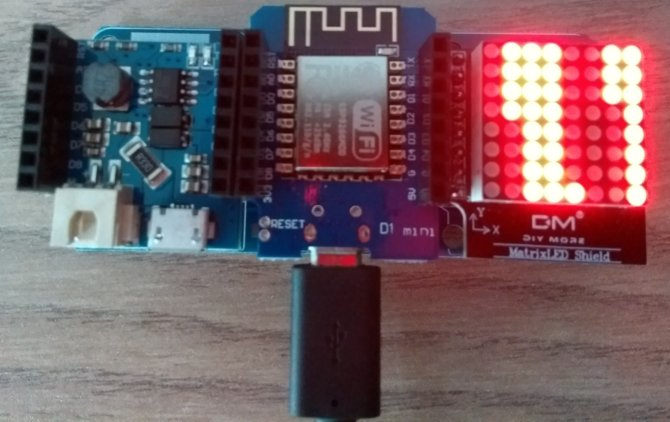

# ledbadge

Look into the 
[ledbadge notebook](http://nbviewer.jupyter.org/github/pintman/ledbadge/blob/master/ledbadge.ipynb) 
for further instructions.

## TODO

- Try using [mpy-cross](https://github.com/micropython/micropython/tree/master/mpy-cross)
  cross compile for compiling the font in the text module into frozen bytecode.
- Network two badges: Idea: The first that is turned, scans for SSIDs of other boards (e.g. ledbadge_server). If none are present, act as server. Otherwise connect to the (first) server that is found.
- An OLED Shield can be integraded as well using the 
[ssd1306](https://micropython-on-wemos-d1-mini.readthedocs.io/en/latest/shields.html#oled) 
package.
- Maybe change LedMatrix zu FrameBuffer
  http://docs.micropython.org/en/latest/library/framebuf.html
- Add schematic
- Make an emulator
